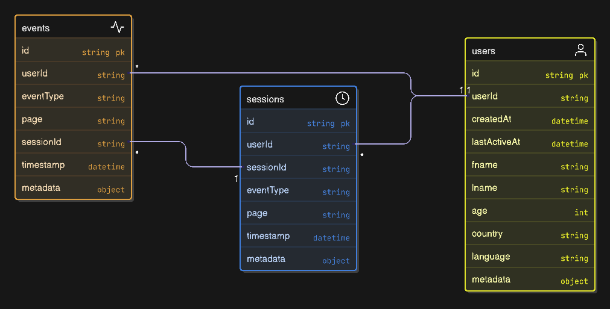

# E-commerce User Analytics Database (L2)

This repository contains the database schema and documentation for the e-commerce user analytics system.

## Database Schema Diagram



## MongoDB Collections
Link: [MongoDB](https://www.mongodb.com/)
### Users Collection

The `users` collection stores user profile information and metadata.

**Interface:**
```typescript
interface User {
  _id: ObjectId;
  userId: string;
  createdAt: Date;
  lastActiveAt: Date;
  fname: string;
  lname: string;
  age: number;
  country: string;
  language: string;
  metadata: Record<string, any>;
}
```

**Example:**
```json
{
  "_id": {
    "$oid": "69500a8d76630a00c502a791"
  },
  "userId": "u1001",
  "createdAt": {
    "$date": "2025-12-17T16:34:21.605Z"
  },
  "lastActiveAt": {
    "$date": "2025-12-20T16:34:21.605Z"
  },
  "fname": "Aarav",
  "lname": "Sharma",
  "age": 37,
  "country": "DE",
  "language": "de",
  "metadata": {}
}
```

**Fields:**
- `_id`: MongoDB ObjectId (Primary Key)
- `userId`: String - Unique user identifier
- `createdAt`: Date - Account creation timestamp
- `lastActiveAt`: Date - Last activity timestamp
- `fname`: String - User's first name
- `lname`: String - User's last name
- `age`: Number - User's age
- `country`: String - Country code (e.g., "DE")
- `language`: String - Language code (e.g., "de")
- `metadata`: Object - Additional user metadata

### Events Collection

The `events` collection stores individual user interaction events.

**Interface:**
```typescript
interface Event {
  _id: ObjectId;
  userId: string;
  sessionId: string;
  eventType: string;
  page: string;
  timestamp: Date;
  metadata: {
    device?: string;
    browser?: string;
    [key: string]: any;
  };
}
```

**Example:**
```json
{
  "_id": {
    "$oid": "69500a8d76630a00c502a896"
  },
  "userId": "u1001",
  "sessionId": "u1001_s1",
  "eventType": "PAGE_VIEW",
  "page": "/category",
  "timestamp": {
    "$date": "2025-12-20T18:24:08.104Z"
  },
  "metadata": {
    "device": "mobile",
    "browser": "firefox"
  }
}
```

**Fields:**
- `_id`: MongoDB ObjectId (Primary Key)
- `userId`: String - Reference to user (Foreign Key)
- `sessionId`: String - Reference to session (Foreign Key)
- `eventType`: String - Type of event (e.g., "PAGE_VIEW")
- `page`: String - Page path/URL
- `timestamp`: Date - Event occurrence timestamp
- `metadata`: Object - Additional event metadata (device, browser, etc.)

### Sessions Collection

The `sessions` collection stores user session information.

**Interface:**
```typescript
interface Session {
  _id: ObjectId;
  userId: string;
  sessionId: string;
  eventType: string;
  page: string;
  timestamp: Date;
  metadata: {
    device?: string;
    browser?: string;
    [key: string]: any;
  };
}
```

**Example:**
```json
{
  "_id": {
    "$oid": "69500a8d76630a00c502a896"
  },
  "userId": "u1001",
  "sessionId": "u1001_s1",
  "eventType": "PAGE_VIEW",
  "page": "/category",
  "timestamp": {
    "$date": "2025-12-20T18:24:08.104Z"
  },
  "metadata": {
    "device": "mobile",
    "browser": "firefox"
  }
}
```

**Fields:**
- `_id`: MongoDB ObjectId (Primary Key)
- `userId`: String - Reference to user (Foreign Key)
- `sessionId`: String - Unique session identifier
- `eventType`: String - Type of event
- `page`: String - Page path/URL
- `timestamp`: Date - Session timestamp
- `metadata`: Object - Additional session metadata

## Relationships

Based on the schema diagram:

- **Users → Events**: One-to-Many relationship (one user can have many events)
- **Users → Sessions**: One-to-Many relationship (one user can have many sessions)
- **Sessions → Events**: One-to-Many relationship (one session can have many events)

## Indexes

For optimal query performance, consider creating indexes on:
- `users.userId` (unique + asc)
- `users.country` (asc)
- `users.lastActiveAt` (desc)

- `sessions.userId` (asc)
- `sessions.sessionId` (unique + asc)
- `sessions.startedAt` (desc)

- `events.userId` (asc)
- `events.sessionId` (asc)
- `events.timestamp` (asc)
- `events.eventType` (asc)
- `events.sessionId, events.timestamp` (asc)
- `events.sessionId, events.timestamp, events.eventType, events.userId` (asc)
