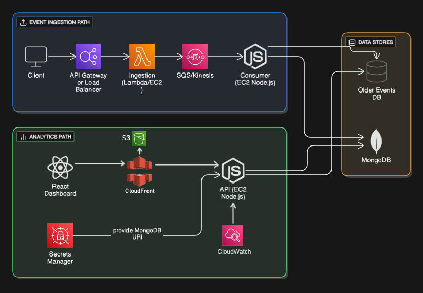

# DevOps & CI/CD (L3)

## Overview
The system consists of:
- **Frontend**: React Dashboard
- **Backend**: Node.js + Express.js APIs & Consumers running on EC2 with PM2.
- **Cloud**: AWS CloudFront, S3 Bucket, IAM, EC2, CloudWatch Metrics and MongoDB.
- **CI/CD**: GitHub Actions.

---

## DevOps Principles Used
- **Automated CI/CD** – No manual deployments
- **Observability** – CloudWatch logs, metrics, and alarms
- **Security by Default**
  - IAM roles (no hardcoded credentials For EC2)
  - User with only required permission for GitHub deployment
  - Secrets managed via GitHub Secrets / AWS SSM

---

## CI/CD Architecture (GitHub Actions)

### Repositories

FE & BE has an **independent GitHub Actions pipeline**.

---

## Frontend CI/CD

This project uses a **GitHub Actions** CI/CD pipeline to automatically build and deploy the frontend to AWS S3 and serve it via CloudFront.

- **Workflow:** Deploy Frontend to CloudFront
- **Triggers:**
  - Automatic on push to the `main` branch (only when `frontend/**` changes)
  - Manual trigger using `workflow_dispatch`
- **What it does:**
  - Triggers on push to main (only when frontend/\*\* changes) or manual dispatch
  - Installs dependencies using Node.js 22.x
  - Builds the frontend using Vite
  - Uploads the production build to Amazon S3
  - Invalidates the CloudFront cache to reflect the latest changes
  - Prints the deployed CloudFront URL in the workflow logs

🔗 **Workflow file:** [Deploy Frontend to CloudFront](https://github.com/sunillohar-job/ecommerce-user-analytics/actions/workflows/frontend-deploy.yml)  

---
## Backend CI/CD

This project uses **GitHub Actions** to deploy the backend to an EC2 instance.

- **Workflow:** Deploy Backend to EC2  
- **Triggers:**
  - Automatic on push to the `main` branch (only when `backend/**` changes)
  - Manual trigger using `workflow_dispatch`
- **What it does:**
  - Connects to EC2 via SSH
  - Pulls the latest code
  - Installs dependencies and runs tests
  - Builds the backend
  - Restarts the service using **PM2**

🔗 **Workflow file:** [Deploy Backend to EC2](https://github.com/sunillohar-job/ecommerce-user-analytics/actions/workflows/backend-deploy.yml)  
