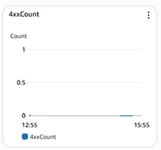
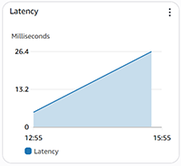
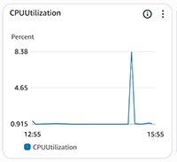
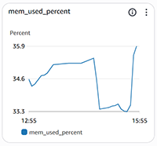
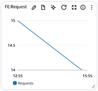
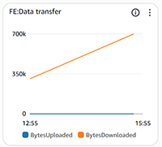

# System Performance Dashboard (CloudFront)

This file contains documentation for a **System Performance Dashboard** built using **AWS CloudFront and AWS monitoring services**.  
The dashboard provides real-time and historical visibility into **frontend traffic, performance, and system resource utilization**.

---

## Overview

The System Performance Dashboard helps monitor:

- Client-side errors (4xx)
- Application latency
- Infrastructure health (CPU & memory)
- Frontend request volume
- Data transfer usage

It is designed to help teams **identify performance bottlenecks, detect anomalies, and ensure system reliability**.

---

## Architecture Summary

- **CloudFront** – Content delivery and frontend traffic monitoring
- **CloudWatch Metrics** – Performance and resource monitoring
- **CloudWatch Dashboards** – Centralized visualization
- **EC2** – Backend infrastructure metrics

---

## Dashboard Metrics

Below are the key metrics tracked in the dashboard along with screenshot placeholders.

---

### 1 4xx Error Count

Tracks the number of client-side errors such as **400, 403, and 404** responses served via CloudFront.

**Purpose:**
- Identify broken links
- Detect authorization or request issues
- Monitor frontend/API misuse

---

### 2 Latency

Measures the time taken to serve requests through CloudFront.

**Purpose:**
- Detect performance degradation
- Monitor edge-to-origin response times
- Improve user experience

---

### 3 CPU Utilization

Shows CPU usage of backend compute resources serving requests.

**Purpose:**
- Identify CPU bottlenecks
- Assist in scaling decisions
- Prevent performance saturation

---

### 4 Memory Used Percentage (`mem_used_percent`)

Tracks memory consumption of backend services.

**Purpose:**
- Detect memory leaks
- Prevent out-of-memory failures
- Optimize resource allocation

---

### 5 FE: Requests

Displays the total number of **frontend requests** received via CloudFront.

**Purpose:**
- Monitor traffic patterns
- Identify peak usage times
- Correlate traffic with performance issues

---

### 6 FE: Data Transfer

Tracks the volume of data transferred from CloudFront to end users.

**Purpose:**
- Monitor bandwidth usage
- Control CDN costs
- Optimize asset sizes and caching

---

## Benefits

- Centralized monitoring
- Faster issue detection
- Improved system reliability
- Better cost and performance optimization

---

## Future Enhancements

- Add alarms and notifications
- Include 5xx error tracking
- Add request rate & cache hit ratio

---

## Notes

- All metrics are sourced from **AWS CloudWatch**
- Metric names may vary slightly based on AWS resource type

---

**Maintained by:** Sunil Lohar  
**Last Updated:** 31-12-2025

